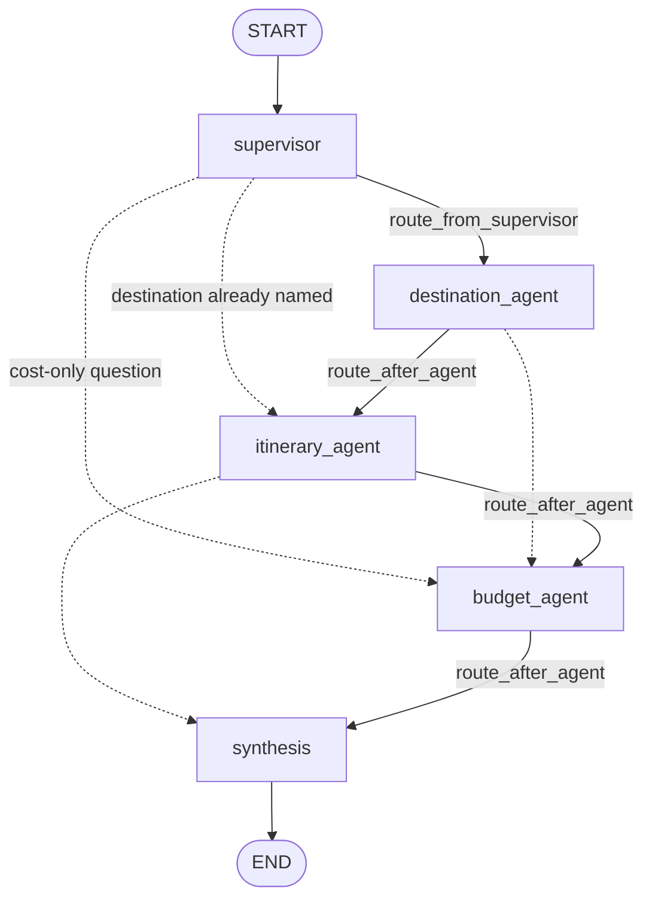

# Multi-Agent Travel Planner — API

You send something like *"a five day trip somewhere warm in Europe for under 1500 pounds"* and get back one plan. Behind it are three agents — destination, itinerary and budget — that run in order, each building on what the last produced. The response names the agents that contributed, and every run is written to an audit trail.

FastAPI + LangGraph + Postgres. The React frontend lives in its own repository:
`https://github.com/YOUR-USER/trip-planner-frontend` <!-- TODO: real URL -->

---

## Running it

You need Python 3.13+, [uv](https://docs.astral.sh/uv/), a Groq API key (the free tier is fine) and a Postgres URL.

```bash
cp .env.example .env      # fill in GROQ_API_KEY and DATABASE_URL
uv sync
uv run python main.py     # http://127.0.0.1:8000, interactive docs at /docs
```

Tables are created on startup, so there is no migration step.

Two things that will cost you ten minutes if you hit them cold:

**Run from the repository root.** `pyproject.toml` has no `[build-system]`, so uv treats this as a virtual project and never installs it. `from app.configs import ...` resolves only because `app/` sits in the working directory. Launch from anywhere else and the imports break.

**Use `uv run`, not bare `python`.** If Anaconda is first on your PATH you will get a `ModuleNotFoundError` for a package that is definitely installed in `.venv`.

## Environment

| Variable | Required | Notes |
| --- | --- | --- |
| `GROQ_API_KEY` | yes | free tier at console.groq.com |
| `DATABASE_URL` | yes | Postgres. I used Neon's free tier |
| `GROQ_MODEL` | no | defaults to `llama-3.3-70b-versatile` |
| `CORS_ORIGINS` | no | comma-separated; defaults to the Vite dev server |

`CORS_ORIGINS` defaults to **both 5173 and 5174**. Vite silently falls back to 5174 when 5173 is taken, and the resulting preflight rejection surfaces in the browser as "could not reach the API" — which reads as the backend being down when it is running perfectly well.

---

## How the orchestration works

A supervisor reads the request and decides which specialists it actually needs. If a destination was named, the destination agent is skipped. Whatever it picks runs in a fixed order, because the dependencies are real: you cannot plan days without a destination, and you cannot cost a plan that does not exist yet.



Solid edges are the full chain; dotted edges are the skips a conditional edge can take when the supervisor did not select an agent. Synthesis always runs and writes the final answer.

The whole graph is five nodes and two static edges — `START → supervisor` and `synthesis → END`. Everything between them is conditional.

### One request, end to end

**The API seeds the state.** `POST /plans` mints a `plan_id` and invokes the graph with `messages`, `plan_id`, `user_id` and `user_query`. That `plan_id` is also the LangGraph thread id — see [Re-opening a plan](#re-opening-a-plan) for why that matters.

**The supervisor makes the only routing decision** (`app/agents/supervisor.py`). It asks the model once for a selection plus the extracted constraints, then does three things to what comes back — two of them defensive:

1. Filters the picks against `KNOWN_AGENTS`, so an invented agent name is dropped rather than routed to.
2. Falls back to `["itinerary_agent"]` if nothing survives. An empty selection would leave synthesis with nothing to work from.
3. Appends `budget_agent` whenever `to_number(trip_constraints["budget_amount"])` parses. The model is free to return a budget while omitting the agent that checks it — well-formed, but contradictory, and a budget that is never checked is the worst version of "silently exceeded". This is a routing override, not just a prompt rule.

**Routing walks the chain** (`app/graph.py`). `route_from_supervisor` returns the first of `selected_agents_in_order(state)`, or `"synthesis"` if the list is empty. After each specialist, `route_after_agent(name)` scans `AGENT_ORDER` **forward only** — `AGENT_ORDER[current_position + 1:]` — for the next selected agent, and falls through to synthesis when there isn't one. All four conditional edges share one path map, `ROUTE_MAP`.

Two things follow from "forward only": the graph cannot loop, and skipping needs no special case — an unselected agent is simply never a routing target. `selected_agents_in_order` re-sorts the supervisor's list into `AGENT_ORDER`, which is why appending `budget_agent` in step 3 above cannot break sequencing.

These routers are pure functions of state. That is what makes the chain debuggable rather than emergent — you can read the path a request will take without running a model.

**Synthesis writes the answer** (`app/agents/synthesis.py`). It reads `destination_results`, `itinerary` and `budget_results` — the markdown strings only, never the structured dicts — and names the agents that contributed. A *successful* supervisor is excluded from that list, because orchestration is not a knowledge contribution; a *failed* one is still reported, because it means no specialist ran at all.

### How state moves between agents

`TravelState` (`app/schema/state.py`) is a LangGraph `TypedDict`. Only two fields accumulate — `messages` and `contributing_agents`, both `Annotated[..., operator.add]`. **Everything else is last-write-wins**, and that is the mechanism the chain runs on rather than an incidental detail: the destination agent returns `{**trip_constraints, "destination": recommended}`, replacing the dict wholesale, so itinerary and budget just read the resolved destination out of the state they were handed.

Each specialist writes two keys — the structure it produced, and a markdown rendering of it:

| Agent | Structured | Markdown | Also writes |
| --- | --- | --- | --- |
| `destination_agent` | `destination_choice` | `destination_results` | `trip_constraints` (overwritten) |
| `itinerary_agent` | `itinerary_plan` | `itinerary` | |
| `budget_agent` | `budget_assessment` | `budget_results` | |

The markdown is a view of the structure, not the source. Synthesis consumes the markdown; the React UI consumes the structure. An agent that stopped emitting its markdown would silently degrade the final answer, which is why the `_format()` helpers are load-bearing rather than cosmetic.

### When an agent fails

The run does not die. `@audited` in `app/agents/base.py` wraps every node: it catches the exception, records the invocation as `failed`, returns an empty delta, and appends `"<name> (failed)"` to `contributing_agents`.

Because that list accumulates, one string is the single source for two consumers — synthesis reads it to tell the model which sections are missing, and `_agent_status` in the streaming route reads it to set the SSE status. Neither invents an outcome, so what the user sees, what the stream reports, and what the audit log says cannot drift apart.

### Adding a fourth agent

Sequential by design, but not closed. A new specialist means touching:

- `app/agents/<name>.py` and `app/agents/__init__.py`
- `app/prompts/<name>.py`
- `AGENT_ORDER`, `ROUTE_MAP` and a node registration in `app/graph.py`
- `AGENT_SEQUENCE` in `app/agents/base.py`
- the agent list in the supervisor prompt
- the output keys in `TravelState`

Nothing else — routing picks it up from `AGENT_ORDER` automatically.

## Where the behavioural rules are enforced

The brief says these agents "must never" do certain things. A prompt instruction is not a guarantee, so wherever a rule is mechanically checkable it is checked in code.

**Destination** (`app/agents/destination.py`) — discards any candidate the model itself flagged as breaking a hard constraint *before* choosing, and re-picks if its own recommendation is not viable. This fires in practice; the model does emit violating candidates. The rejected list and the reason are kept, so the filtering is visible rather than claimed.

**Budget** (`app/agents/budget.py`) — recomputes the verdict and **fails closed**:

- the comparison is anchored on the budget the *user* stated. The model echoes one back and that echo can drift upward; trusting it would stamp a verified-looking pass on a real overage.
- `within_budget` is tri-state. `None` means "could not verify" — an unparseable figure, or a currency mismatch — and is never conflated with `True`.
- the resolved budget is written back into the assessment, so a client compares against the same number the verdict used.
- the cheaper alternative's savings are summed and checked against the shortfall. One that falls short is reported as insufficient rather than presented as the fix.

**Supervisor** (`app/agents/supervisor.py`) — forces `budget_agent` into the selection whenever a budget was extracted. The model can otherwise return a `budget_amount` while omitting the agent: well-formed, but contradictory, and a budget that is never checked is the worst version of "silently exceeded".

**Itinerary** — realistic timings and stated uncertainty are a judgement only the model can make, so that one lives in the prompt. It does have somewhere to land: every segment carries an `uncertainty` field, so the doubt is addressable data rather than a phrase buried in a paragraph.

Attribution and audit come from one place. The `@audited` decorator in `app/agents/base.py` times each agent, writes its `agent_invocations` row, captures the provider's real token counts, and appends to `contributing_agents` — so what a caller sees and what the log says cannot drift apart.

---

## API

| Method | Path | Who | What |
| --- | --- | --- | --- |
| POST | `/plans` | anyone | runs the chain, returns the finished answer |
| POST | `/plans/stream` | anyone | the same run as SSE, one event per agent |
| GET | `/plans/{id}/result` | anyone | re-open a finished plan |
| GET | `/plans/{id}` | anyone | the audit record for a run |
| GET | `/audit/requests` | anyone | request log, scoped to you unless admin |
| GET | `/audit/invocations` | admin | flat per-agent log across all requests |
| GET | `/metrics` | admin | counts, timings and token usage |
| GET | `/health` | anyone | |

### Streaming

`POST /plans/stream` takes the same body and headers as `POST /plans` and emits:

```text
start   → { plan_id }
routed  → { selected_agents, supervisor_reasoning }
agent   → { agent_name, status, duration_ms }     (one per node)
done    → the full PlanResponse
error   → { detail }
```

Two details make the progress real rather than decorative. `routed` carries the supervisor's own `selected_agents`, so a client knows the actual chain from the first event. And each `agent` status is read off the `(failed)` suffix the audit decorator writes — not invented.

Once the 200 and headers are sent a failure cannot be an HTTP status, so it arrives as an `error` event; a `finally` closes the audit row if the client disconnects mid-run.

`POST /plans` is the simpler blocking path and the easiest way to try the API from curl. Both build their payload with the same `_plan_response()`, so the two cannot drift.

### Re-opening a plan

`GET /plans/{id}/result` replays a finished plan from the LangGraph checkpoint. The answer was never duplicated into the audit tables — it is reachable because `plan_requests.id` **is** the thread id — so there is no second copy that can fall out of step. Non-admins are scoped by the audit row first, so this cannot be used to read someone else's thread by guessing an id.

### The contract with the frontend

`PlanResponse` returns `destination_choice`, `itinerary_plan` and `budget_assessment` as loose `dict[str, Any] | None`, deliberately not as nested pydantic models. This is unvalidated model output: a cost may arrive as `1200` or `"£1,200"`, and any key may be missing. Strict models would turn a model quirk into a 500 on a run that otherwise succeeded.

The shape is enforced on the client instead, in the frontend repository's `src/types/api.ts`, where being wrong is a compile error rather than a failed request. **With the two repositories separate, nothing structurally ties them together** — if you change one of these payloads, change the types over there in the same breath.

`null` on any of the three means that agent did not run.

---

## Auth

There isn't any. You claim an identity with an `X-User-Email` header and the server believes you. Anyone who can set a header can be an admin.

That is deliberate — the brief asks for a stub and explicitly says not to build enterprise identity. What is real is the shape: roles live on the user row in the database rather than in the request, the check happens in one place (`app/api/deps.py`), and non-admins are scoped by a SQL `WHERE` clause rather than by filtering rows after the fact. Swapping in real auth means replacing `current_user` and nothing else.

Admins see two things ordinary users do not: cost and per-agent timing on a plan, and everyone's rows instead of only their own.

## Data model

Four tables in `app/db/schema.sql`, applied idempotently at startup.

- **`plan_requests.id` is the LangGraph thread id.** One identifier, so there is no alias to keep in sync. The join to the library-owned checkpoint tables is by that shared id, deliberately not a foreign key.
- **`agent_invocations`** is one row per agent run, with real token counts from `response.usage_metadata` — measured, not estimated. `output_summary` is truncated, because the full state already lives in the checkpoint under the same id.
- **Cost is rolled up onto `plan_requests`**, so "what did this request cost" is one row read while "which agent is expensive" is one aggregate.
- **`users.id` is a surrogate UUID.** Email and username both change, and a primary key that changes breaks every foreign key pointing at it. Login uniqueness is a functional index on `lower(email)`.

## Layout

```text
main.py         uvicorn launcher for app.api.server:api_app
app/
  graph.py      orchestration — routing and chaining
  agents/       one file per agent, plus base.py (LLM calls, @audited, coercion)
  prompts/      one file per agent; behavioural constraints live here
  api/          routes.py, server.py, deps.py (the auth stub)
  schema/       state.py (TravelState) + api.py (pydantic models)
  db/           pool, checkpointer, schema.sql, audit repository, metrics
  configs/      env values only
  llms/         chat-model factory
```